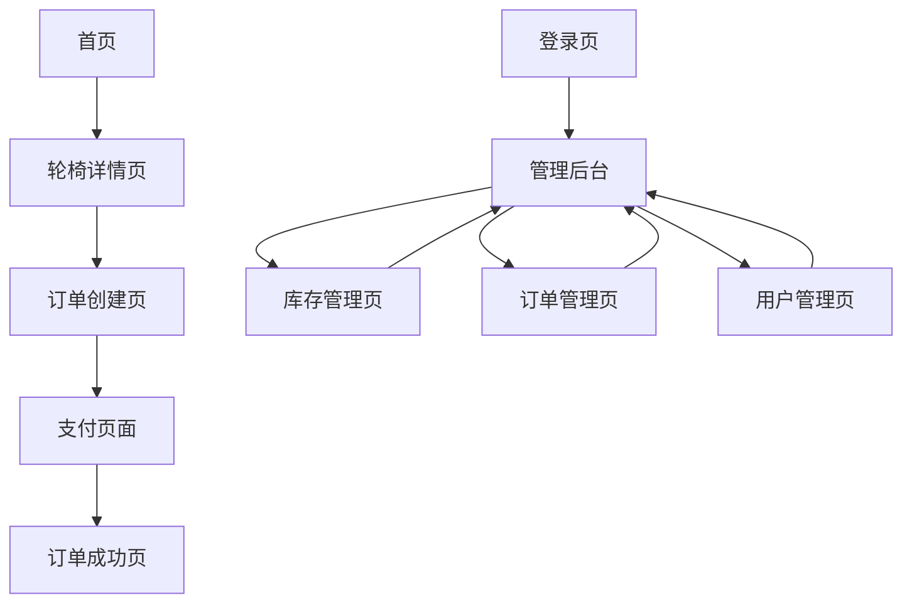

# 在线轮椅租赁系统产品需求文档

## 1. Product Overview

在线轮椅租赁系统是一个为失能老人提供智能轮椅租赁服务的综合平台，采用前后端分离架构，包含面向顾客的客户端和面向内部员工的管理端。

系统主要解决失能老人轮椅租赁需求，为用户提供便捷的在线租赁服务，为企业提供高效的库存和订单管理工具。

目标是构建一个功能完善、操作简便、安全可靠的轮椅租赁服务平台，提升服务效率和用户体验。

## 2. Core Features

### 2.1 User Roles

| 角色 | 注册方式 | 核心权限 |
|------|----------|----------|
| 普通用户 | 无需注册，直接使用 | 浏览轮椅、创建订单、查看订单详情 |
| 操作员 | 管理员创建账号 | 管理库存、处理订单、查看操作日志 |
| 管理员 | 系统预设账号 | 全部权限，包括用户管理、系统配置 |

### 2.2 Feature Module

我们的轮椅租赁系统包含以下主要页面：

**客户端页面：**
1. **首页**：轮椅搜索、轮椅列表展示、大字模式切换
2. **轮椅详情页**：详细信息展示、立即租赁按钮
3. **订单创建页**：用户信息填写、订单确认
4. **支付页面**：模拟支付流程、订单提交
5. **订单成功页**：支付成功确认、订单信息展示

**管理端页面：**
1. **登录页**：管理员身份验证
2. **管理后台布局页**：侧边菜单、权限控制
3. **库存管理页**：轮椅增删改查、库存操作
4. **订单管理页**：订单列表、状态更新
5. **用户管理页**：管理员账号管理（仅管理员可见）

### 2.3 Page Details

| 页面名称 | 模块名称 | 功能描述 |
|----------|----------|----------|
| 首页 | 搜索模块 | 支持关键词搜索轮椅，按价格排序 |
| 首页 | 轮椅列表 | 展示轮椅信息，分页显示，支持筛选 |
| 首页 | 大字模式 | 全局字体大小切换，适应老年用户 |
| 轮椅详情页 | 详情展示 | 显示轮椅完整信息、图片、价格、库存 |
| 轮椅详情页 | 租赁按钮 | 跳转到订单创建页面 |
| 订单创建页 | 信息填写 | 用户姓名、电话、地址表单验证 |
| 订单创建页 | 订单预览 | 显示选中轮椅信息和总价 |
| 支付页面 | 支付确认 | 模拟支付流程，订单最终提交 |
| 订单成功页 | 成功提示 | 显示订单号和配送信息 |
| 登录页 | 身份验证 | 用户名密码登录，JWT令牌生成 |
| 管理后台 | 侧边菜单 | 根据角色动态显示菜单项 |
| 管理后台 | 权限控制 | 路由守卫，角色权限验证 |
| 库存管理页 | 轮椅列表 | 显示所有轮椅信息，支持搜索 |
| 库存管理页 | 增删改查 | 新增、编辑、删除、下架轮椅 |
| 库存管理页 | 操作日志 | 记录所有库存操作行为 |
| 订单管理页 | 订单列表 | 显示所有订单，支持状态筛选 |
| 订单管理页 | 状态更新 | 修改订单状态，自动更新库存 |
| 用户管理页 | 用户列表 | 显示管理员和操作员信息 |
| 用户管理页 | 用户操作 | 新增、编辑管理用户，角色分配 |

## 3. Core Process

**普通用户租赁流程：**
用户访问首页 → 搜索/浏览轮椅 → 查看轮椅详情 → 填写租赁信息 → 确认订单 → 模拟支付 → 订单成功

**管理员操作流程：**
管理员登录 → 进入管理后台 → 管理库存/订单/用户 → 处理业务操作 → 查看操作日志

**订单处理流程：**
用户提交订单 → 系统创建临时订单 → 用户确认支付 → 生成正式订单 → 更新库存 → 管理员处理配送

## 4. User Interface Design

### 4.1 Design Style

- **主色调**：蓝色系 (#409EFF) 作为主色，绿色 (#67C23A) 作为成功色
- **按钮样式**：圆角按钮，支持大字模式下的尺寸调整
- **字体**：系统默认字体，支持大字模式切换（14px/18px/22px）
- **布局风格**：卡片式布局，清晰的层次结构，适合老年用户操作
- **图标风格**：Element Plus 图标库，简洁明了的线性图标

### 4.2 Page Design Overview

| 页面名称 | 模块名称 | UI元素 |
|----------|----------|--------|
| 首页 | 搜索区域 | 大尺寸搜索框，醒目的搜索按钮，排序下拉菜单 |
| 首页 | 轮椅列表 | 卡片式布局，清晰的图片和价格显示，大字体支持 |
| 首页 | 大字模式切换 | 右上角切换按钮，三档字体大小选择 |
| 轮椅详情页 | 详情卡片 | 大图展示，详细参数表格，醒目的租赁按钮 |
| 订单创建页 | 表单区域 | 清晰的标签，大尺寸输入框，实时验证提示 |
| 支付页面 | 确认区域 | 订单摘要卡片，大尺寸确认按钮，安全提示 |
| 管理后台 | 侧边菜单 | 深色主题，图标+文字，角色权限控制 |
| 管理后台 | 数据表格 | 分页表格，操作按钮组，筛选器 |
| 管理后台 | 弹窗表单 | 模态对话框，表单验证，确认/取消按钮 |

### 4.3 Responsiveness

系统采用桌面优先设计，同时支持移动端适配。客户端特别优化触摸交互，考虑老年用户的操作习惯，按钮尺寸较大，间距适中。管理端主要面向桌面端使用，提供高效的数据管理界面。