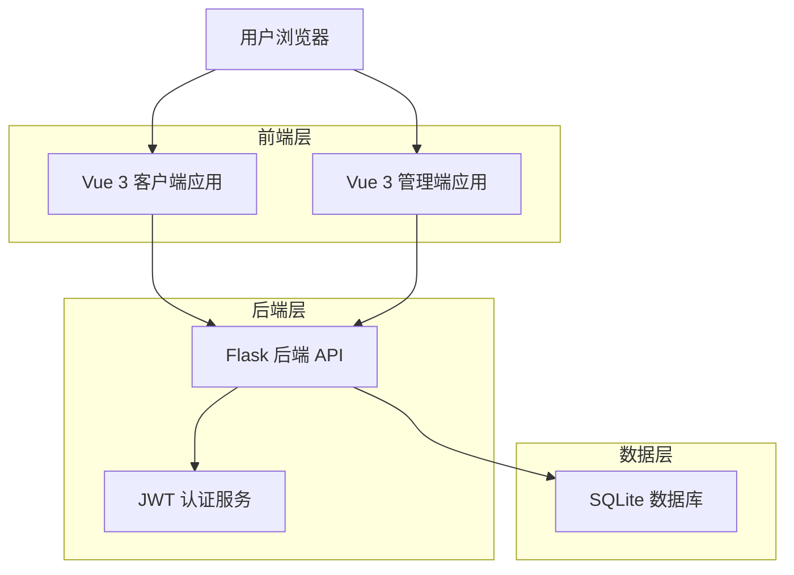
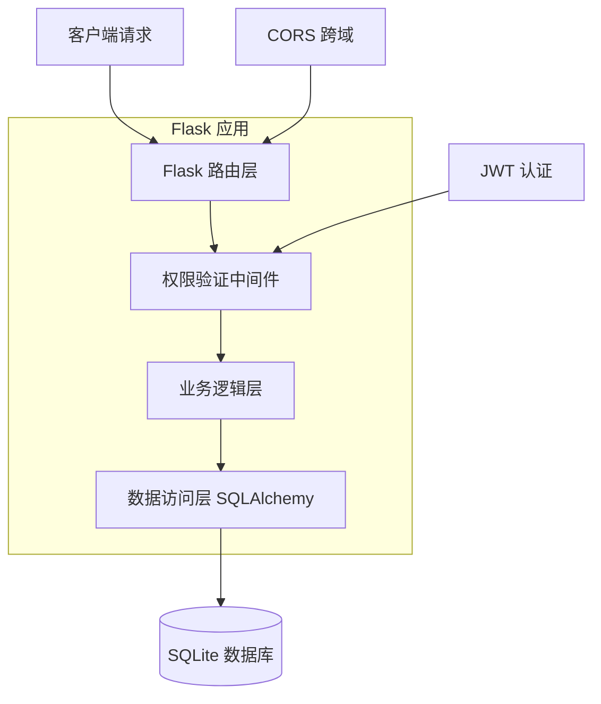
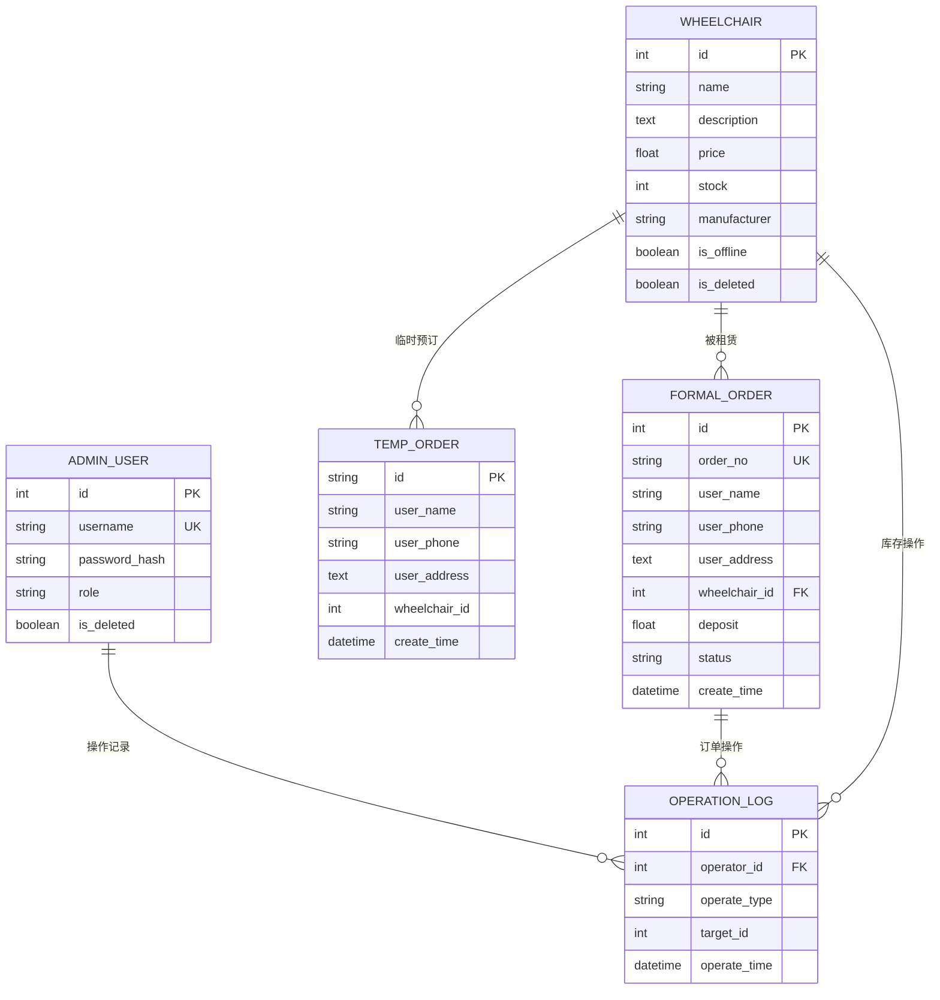

# 在线轮椅租赁系统技术架构文档

## 1. Architecture design



## 2. Technology Description

* 前端客户端: Vue\@3 + Element Plus + Pinia + Vue Router + Axios + Vite

* 前端管理端: Vue\@3 + Element Plus + Pinia + Vue Router + Axios + Vite

* 后端: Flask\@2.0+ + Flask-SQLAlchemy + Flask-JWT-Extended + Flask-CORS + bcrypt

* 数据库: SQLite\@3.30+

* 部署: Gunicorn + Nginx

## 3. Route definitions

### 3.1 客户端路由

| Route                  | Purpose      |
| ---------------------- | ------------ |
| /home                  | 首页，轮椅搜索和列表展示 |
| /wheelchair/detail/:id | 轮椅详情页，显示详细信息 |
| /order/create          | 订单创建页，用户信息填写 |
| /payment               | 支付页面，模拟支付流程  |
| /order/success         | 订单成功页，确认信息   |

### 3.2 管理端路由

| Route            | Purpose                 |
| ---------------- | ----------------------- |
| /login           | 登录页，管理员身份验证             |
| /admin           | 管理后台布局页，侧边菜单和权限控制       |
| /admin/inventory | 库存管理页，轮椅增删改查            |
| /admin/order     | 订单管理页，订单状态管理            |
| /admin/user      | 用户管理页，管理员账号管理（仅admin角色） |

## 4. API definitions

### 4.1 客户端 API (路径前缀: /api)

**轮椅搜索**

```
GET /api/wheelchair/search
```

参数:

| 参数名        | 参数类型    | 是否必需  | 描述                             |
| ---------- | ------- | ----- | ------------------------------ |
| keyword    | string  | false | 搜索关键词                          |
| sort\_type | string  | false | 排序类型 (price\_asc, price\_desc) |
| page       | integer | false | 页码，默认1                         |
| limit      | integer | false | 每页数量，默认10                      |

响应:

| 参数名        | 参数类型    | 描述   |
| ---------- | ------- | ---- |
| code       | integer | 状态码  |
| data       | object  | 数据对象 |
| data.list  | array   | 轮椅列表 |
| data.total | integer | 总数量  |

示例:

```json
{
  "code": 200,
  "data": {
    "list": [
      {
        "id": 1,
        "name": "电动轮椅A型",
        "description": "适合老年人使用的电动轮椅",
        "price": 150.0,
        "stock": 5,
        "manufacturer": "康复设备公司"
      }
    ],
    "total": 1
  }
}
```

**轮椅详情**

```
GET /api/wheelchair/detail/<int:id>
```

**创建预订单**

```
POST /api/order/precreate
```

请求体:

| 参数名            | 参数类型    | 是否必需 | 描述   |
| -------------- | ------- | ---- | ---- |
| name           | string  | true | 用户姓名 |
| phone          | string  | true | 手机号码 |
| address        | string  | true | 收货地址 |
| wheelchair\_id | integer | true | 轮椅ID |

**提交正式订单**

```
POST /api/order/submit
```

请求体:

| 参数名            | 参数类型   | 是否必需 | 描述    |
| -------------- | ------ | ---- | ----- |
| pre\_order\_id | string | true | 预订单ID |

### 4.2 管理端 API (路径前缀: /api/admin)

**管理员登录**

```
POST /api/admin/login
```

请求体:

| 参数名      | 参数类型   | 是否必需 | 描述  |
| -------- | ------ | ---- | --- |
| username | string | true | 用户名 |
| password | string | true | 密码  |

响应:

| 参数名        | 参数类型    | 描述    |
| ---------- | ------- | ----- |
| code       | integer | 状态码   |
| data       | object  | 数据对象  |
| data.token | string  | JWT令牌 |
| data.role  | string  | 用户角色  |

**库存管理**

```
GET /api/admin/inventory/list
POST /api/admin/inventory/save
POST /api/admin/inventory/operate
```

**订单管理**

```
GET /api/admin/order/list
POST /api/admin/order/update/status
```

**用户管理**

```
GET /api/admin/user/list
POST /api/admin/user/save
```

## 5. Server architecture diagram



## 6. Data model

### 6.1 Data model definition



### 6.2 Data Definition Language

**轮椅表 (wheelchair)**

```sql
-- 创建轮椅表
CREATE TABLE wheelchair (
    id INTEGER PRIMARY KEY AUTOINCREMENT,
    name VARCHAR(100) NOT NULL,
    description TEXT,
    price REAL NOT NULL,
    stock INTEGER NOT NULL DEFAULT 1,
    manufacturer VARCHAR(100),
    is_offline BOOLEAN DEFAULT 0,
    is_deleted BOOLEAN DEFAULT 0
);

-- 创建索引
CREATE INDEX idx_wheelchair_name ON wheelchair(name);
CREATE INDEX idx_wheelchair_price ON wheelchair(price);
CREATE INDEX idx_wheelchair_stock ON wheelchair(stock);

-- 初始化数据
INSERT INTO wheelchair (name, description, price, stock, manufacturer) VALUES
('电动轮椅豪华版', '配备GPS定位、智能刹车系统的高端电动轮椅', 200.0, 3, '智能康复设备有限公司'),
('手动轮椅标准版', '轻便耐用的手动轮椅，适合日常使用', 80.0, 5, '康复器械制造厂'),
('电动轮椅经济版', '性价比高的电动轮椅，操作简单', 120.0, 4, '医疗设备公司'),
('折叠轮椅便携版', '可折叠设计，方便携带和存储', 100.0, 6, '便民医疗器械');
```

**正式订单表 (formal\_order)**

```sql
-- 创建正式订单表
CREATE TABLE formal_order (
    id INTEGER PRIMARY KEY AUTOINCREMENT,
    order_no VARCHAR(50) UNIQUE NOT NULL,
    user_name VARCHAR(50) NOT NULL,
    user_phone VARCHAR(20) NOT NULL,
    user_address TEXT NOT NULL,
    wheelchair_id INTEGER NOT NULL,
    deposit REAL NOT NULL,
    status VARCHAR(20) NOT NULL DEFAULT '待配送',
    create_time DATETIME DEFAULT CURRENT_TIMESTAMP,
    FOREIGN KEY (wheelchair_id) REFERENCES wheelchair(id)
);

-- 创建索引
CREATE INDEX idx_formal_order_no ON formal_order(order_no);
CREATE INDEX idx_formal_order_status ON formal_order(status);
CREATE INDEX idx_formal_order_create_time ON formal_order(create_time DESC);
```

**管理用户表 (admin\_user)**

```sql
-- 创建管理用户表
CREATE TABLE admin_user (
    id INTEGER PRIMARY KEY AUTOINCREMENT,
    username VARCHAR(50) UNIQUE NOT NULL,
    password_hash VARCHAR(255) NOT NULL,
    role VARCHAR(20) NOT NULL CHECK (role IN ('operator', 'admin')),
    is_deleted BOOLEAN DEFAULT 0
);

-- 创建索引
CREATE INDEX idx_admin_user_username ON admin_user(username);
CREATE INDEX idx_admin_user_role ON admin_user(role);

-- 初始化管理员账号 (密码: 123456)
INSERT INTO admin_user (username, password_hash, role) VALUES
('admin', '$2b$12$LQv3c1yqBWVHxkd0LHAkCOYz6TtxMQJqhN8/LewdBPj6hsxq5S/kS', 'admin'),
('operator1', '$2b$12$LQv3c1yqBWVHxkd0LHAkCOYz6TtxMQJqhN8/LewdBPj6hsxq5S/kS', 'operator');
```

**操作日志表 (operation\_log)**

```sql
-- 创建操作日志表
CREATE TABLE operation_log (
    id INTEGER PRIMARY KEY AUTOINCREMENT,
    operator_id INTEGER NOT NULL,
    operate_type VARCHAR(50) NOT NULL,
    target_id INTEGER,
    operate_time DATETIME DEFAULT CURRENT_TIMESTAMP,
    FOREIGN KEY (operator_id) REFERENCES admin_user(id)
);

-- 创建索引
CREATE INDEX idx_operation_log_operator ON operation_log(operator_id);
CREATE INDEX idx_operation_log_time ON operation_log(operate_time DESC);
CREATE INDEX idx_operation_log_type ON operation_log(operate_type);
```

**临时预订单表 (temp\_order)**

```sql
-- 创建临时预订单表
CREATE TABLE temp_order (
    id VARCHAR(50) PRIMARY KEY,
    user_name VARCHAR(50),
    user_phone VARCHAR(20),
    user_address TEXT,
    wheelchair_id INTEGER,
    create_time DATETIME DEFAULT CURRENT_TIMESTAMP
);

-- 创建索引
CREATE INDEX idx_temp_order_create_time ON temp_order(create_time);
CREATE INDEX idx_temp_order_wheelchair ON temp_order(wheelchair_id);
```

